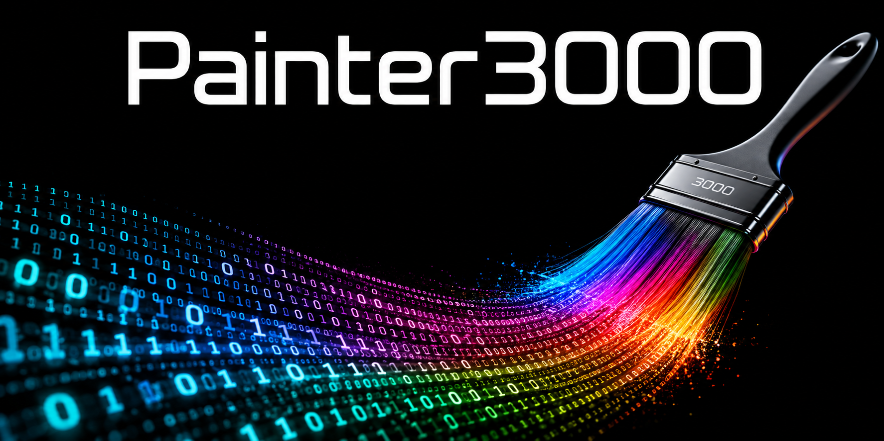

<p align="center">
  
</p>


# AMD ROCm/RDNA4 Ports + CUDA/Blackwell Wheel Helpers

I work on practical GPU enablement for 3D AI, differentiable rendering, Gaussian splatting, neural graphics, and reconstruction pipelines.

My main AMD target stack:

- AMD Radeon AI PRO R9700 / RDNA4 / gfx1201
- ROCm 7.2
- Python 3.12
- PyTorch ROCm builds
- Linux-based local AI / 3D workflows

I also maintain several CUDA wheel helper repositories for newer NVIDIA / Blackwell-oriented environments where upstream wheels are missing or delayed.

---

## AMD ROCm / RDNA4 Ports

### Differentiable Rendering

- [`amd-nvdiffrast-rocm72-gfx1201`](https://github.com/Painter3000/amd-nvdiffrast-rocm72-gfx1201)  
  AMD ROCm 7.2 / RDNA4 / gfx1201 patch and validation bundle for NVLabs nvdiffrast.

- [`amd-2dgs-rocm72-gfx1201`](https://github.com/Painter3000/amd-2dgs-rocm72-gfx1201)  
  Fresh-host qualified AMD ROCm 7.2 / RDNA4 `gfx1201` port and public installer for 2D Gaussian Splatting, verified on AMD Radeon AI PRO R9700.

- [`diff-gaussian-rasterization-rocm72-gfx1201`](https://github.com/Painter3000/diff-gaussian-rasterization-rocm72-gfx1201)  
  ROCm 7.2 / gfx1201 porting work for diff-gaussian-rasterization.

- [`amd-gsplat-rocm72-gfx1201`](https://github.com/Painter3000/amd-gsplat-rocm72-gfx1201)  
  AMD ROCm / gfx1201 porting work for gsplat-style Gaussian splatting workflows.

- [`amd-gaussian-splatting-rocm72-gfx1201`](https://github.com/Painter3000/amd-gaussian-splatting-rocm72-gfx1201)  
  AMD ROCm / RDNA4 porting work for Gaussian Splatting pipelines.

---

### Gaussian Splatting Dependencies

- [`simple-knn-rocm72-gfx1201`](https://github.com/Painter3000/simple-knn-rocm72-gfx1201)  
  ROCm / gfx1201 porting work for simple-knn.

- [`fused-ssim-rocm72-gfx1201`](https://github.com/Painter3000/fused-ssim-rocm72-gfx1201)  
  ROCm / gfx1201 porting work for fused-ssim.

- [`amd-sugar-rocm72-gfx1201`](https://github.com/Painter3000/amd-sugar-rocm72-gfx1201)  
  AMD ROCm / gfx1201 related porting work for SuGaR-style reconstruction workflows.

---

### Neural Graphics / Training Kernels

* [`amd-nerfstudio-rocm72-gfx1201`](https://github.com/Painter3000/amd-nerfstudio-rocm72-gfx1201)
  Qualified AMD ROCm 7.2 / RDNA4 / `gfx1201` integration for the Nerfacto training chain from Nerfstudio, using `tiny-rdna4-nn` and a ROCm-compatible `nerfacc` runtime.

- [`tiny-rdna4-nn`](https://github.com/Painter3000/tiny-rdna4-nn)  
  RDNA4-focused tiny neural network / fused MLP kernel work for AMD gfx1201.

---

## Wheel Helpers

These repositories are primarily wheel/build helper repositories. The wheel projects are **not** the same as the ROCm/gfx1201 ports above.

### CUDA / Blackwell Wheel Helpers

These repositories target CUDA / Blackwell-era environments, including cases where prebuilt upstream wheels are unavailable or not yet aligned with newer CUDA/PyTorch stacks:

- [`pytorch3d-Wheel`](https://github.com/Painter3000/pytorch3d-Wheel)
- [`nvdiffrast_wheel`](https://github.com/Painter3000/nvdiffrast_wheel)
- [`torch_scatter_wheel`](https://github.com/Painter3000/torch_scatter_wheel)
- [`xformers-wheel`](https://github.com/Painter3000/xformers-wheel)
- [`xformers-wheel_cu130`](https://github.com/Painter3000/xformers-wheel_cu130)
- [`kaolin_cu130_wheel`](https://github.com/Painter3000/kaolin_cu130_wheel)
- [`gaussian-wheels`](https://github.com/Painter3000/gaussian-wheels)

---

## Runtime and Utility Projects

- [`amd-gpu-torch-runtime-patch`](https://github.com/Painter3000/amd-gpu-torch-runtime-patch)  
  Runtime patching / helper work for AMD GPU detection and PyTorch workflows.

- [`torch-fade-logger`](https://github.com/Painter3000/torch-fade-logger)  
  Utility project around PyTorch logging / diagnostics.

- [`PIXIE-to-SMPL-X-Converter`](https://github.com/Painter3000/PIXIE-to-SMPL-X-Converter)  
  Conversion helper work around PIXIE / SMPL-X workflows.

---

## Focus

The goal of these repositories is practical GPU enablement:

```text
CUDA-centered or vendor-specific 3D/AI project
        ↓
porting / build repair / validation
        ↓
AMD ROCm/RDNA4 or CUDA/Blackwell target stack
        ↓
reproducible install, wheel, or patch bundle
        ↓
usable local 3D AI workflow
```

Most projects are community ports, validation bundles, wheel helpers, or experimental compatibility layers.
